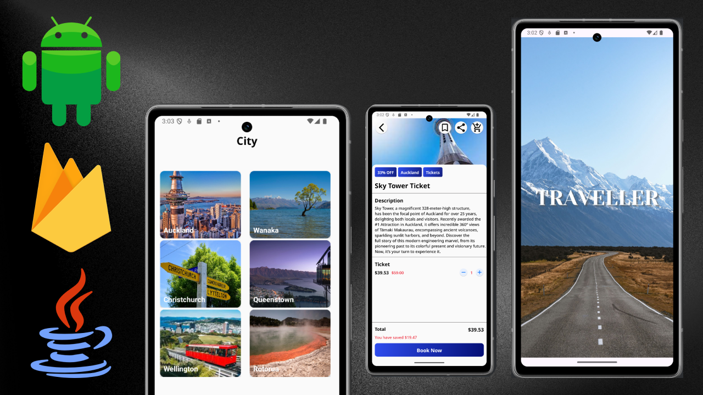
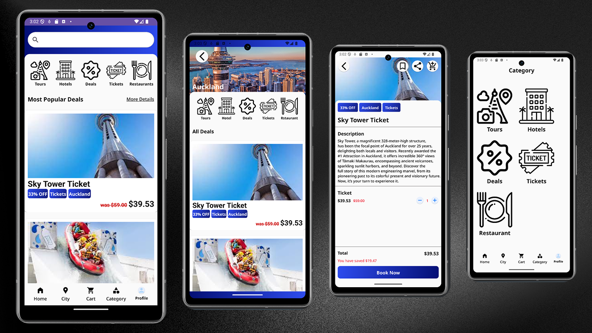

# Traveler Deals Booking — Android App (Java + Firebase)

A role-based Android application to **browse and book travel deals** with category-driven listings, smooth navigation, and Firebase-backed authentication & data storage.

---

## Overview
Traveler Deals Booking lets users explore featured and categorized deals, view details, and complete a booking flow. The app supports **three user roles** (Customer, Supplier, Admin) and provides responsive layouts and error-safe UX.

**Highlights**
- Role-based access (Customer / Supplier / Admin)
- Firebase Authentication & data persistence
- Category-driven listings, search & filters
- Reliable booking flow with loading & error states

---

## Features
- **Home**: Featured deals and category sections
- **Deal Listings**: Title, image, price, discount, category
- **Deal Details**: Full description, tags, price breakdown
- **Search & Filter**: Keyword + category filtering
- **User Profile**: Personal details and booking history
- **Role-based Auth**: Customer, Supplier, Admin
- **Firebase Integration**: Auth + Database (Firestore or Realtime DB) + Storage
- **Responsive UI**: Optimized layouts across screen sizes

---

## Tech Stack
- **Android (Java)**, **XML Layouts**
- **Firebase Authentication**
- **Firebase Firestore / Realtime Database** *(choose one for your build)*
- **Firebase Storage** (images)
- (Optional) **Glide/Picasso** for image loading
- **Material Components** for UI

---

## Project Structure (example)
```
app/
├─ java/com/yourorg/traveler/
│  ├─ ui/               # Activities / Fragments
│  ├─ adapters/         # RecyclerView adapters
│  ├─ models/           # Deal, User, Booking...
│  ├─ data/             # Firebase repositories
│  ├─ utils/            # Helpers, constants
│  └─ MainActivity.java
└─ res/
   ├─ layout/           # XML layouts
   ├─ drawable/         # Icons, shapes
   └─ values/           # colors.xml, styles.xml, strings.xml
```

---

## Data Model (Firestore example)
```
users/{uid} {
  role: "customer" | "supplier" | "admin",
  name: string,
  email: string,
  photoUrl: string
}

deals/{dealId} {
  title: string,
  description: string,
  city: string,
  category: "tours" | "accommodation" | "tickets" | "restaurants" | "...",
  price: number,
  discount: number,
  imageUrl: string,
  supplierId: string,
  createdAt: timestamp,
  updatedAt: timestamp,
  isActive: boolean
}

bookings/{bookingId} {
  userId: string,
  dealId: string,
  quantity: number,
  totalPrice: number,
  bookedAt: timestamp,
  status: "pending" | "confirmed" | "cancelled"
}
```
> Realtime Database can mirror this structure with top-level `users/`, `deals/`, `bookings/` nodes.


## Search & Categories
- **Keyword search** across title/description
- **Category chips/spinner** to filter (e.g., Tours, Accommodation, Tickets, Restaurants)

---

## Screenshots





---

## Notes
- Unauthenticated users may browse read-only content; **booking requires login**.
- If you use **Firestore**, prefer collection-level rules; if **Realtime DB**, design top-level node rules accordingly.
- Consider image caching (Glide) and pagination for large lists.

---

## Outcome
A functional Android app with **Firebase-powered auth and data persistence**, **role-based workflows**, category-driven deals, and a complete booking flow with solid UI/UX.
